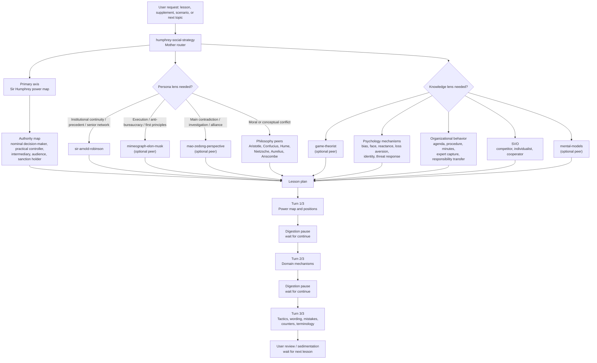
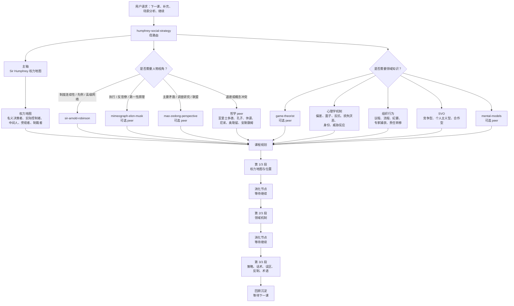

# GCMG Ladder to Apotheosis Skill

Author: **Alden Jin**

English | [中文](#中文说明)

A modular Chinese strategy-learning and power-analysis system for social judgment, hierarchy games, bureaucracy, game theory, psychology, organizational behavior, philosophy, mental models, and institutional power.

Repository name: `GCMG-ladder_to_apotheosis-skill`

## Name Meaning

`GCMG` is intentionally borrowed from *Yes Minister*, Series 2, "Doing the Honours". In the official honours system, GCMG is the post-nominal for **Knight/Dame Grand Cross** in the Most Distinguished Order of St Michael and St George; but Bernard Woolley's civil-service translation is the real joke and the real signal here: **GOD CALLS ME GOD**. In this project, the "ladder to apotheosis" is not merely about a medal. It names the learning ambition: to climb, step by step, toward the almost unreachable Arnoldian ideal of institutional poise, strategic memory, procedural command, and serenely excessive administrative self-possession. See the Royal Family's page on [The Order of St Michael and St George](https://www.royal.uk/order-st-michael-and-st-george) and [Wikiquote's Yes Minister page](https://en.wikiquote.org/wiki/Yes%2C_Minister).

## Design Philosophy

This skill package is designed as a MoE-like teaching system, not a monolithic knowledge dump.

Core principles:

- **Sir Humphrey remains the primary axis**: every lesson starts from nominal authority vs practical control, procedure, agenda, information, timing, responsibility, and sanctions.
- **Persona lenses and knowledge lenses are separated**: characters provide perspective; disciplines explain mechanisms.
- **Arnold is used selectively**: he deepens analysis when the issue involves senior institutional memory, precedent protection, reputation containment, and continuity.
- **Mao-selected-works methodology is auxiliary**: it checks main contradiction, investigation, alliances, and long-game structure, but does not replace the Humphrey axis.
- **Musk is a high-frequency execution lens**: use him for first principles, anti-bureaucracy, owner clarity, speed, and process deletion.
- **Mental models are routed, not dumped**: use only the models that reveal a named blind spot.
- **Lessons are split for density**: one lesson normally unfolds across 2-3 substantial conversations, with explicit digestion pauses.
- **Terminology is mandatory**: every lesson ends with a standalone terminology section.
- **Internal routing stays internal**: the user-facing lesson should not expose implementation labels unless the user asks for system architecture.

## Full Architecture



## Repository Structure

```text
GCMG-ladder_to_apotheosis-skill/
├── README.md
├── LICENSE
├── NOTICE.md
├── PEER-SKILLS.md
├── install.ps1
└── skills/
    ├── humphrey-social-strategy/
    │   ├── SKILL.md
    │   └── agents/openai.yaml
    ├── sir-humphrey/
    │   ├── SKILL.md
    │   ├── agents/openai.yaml
    │   └── references/
    │       ├── model.md
    │       └── sources.md
    └── sir-arnold-robinson/
        ├── SKILL.md
        └── agents/openai.yaml
```

## Included Skills

| Skill | Purpose |
|---|---|
| `humphrey-social-strategy` | Mother router for Chinese fragmented lessons and scenario analysis. It coordinates persona lenses, domain knowledge, lesson pacing, terminology, and output style. |
| `sir-humphrey` | Power hidden in procedure: agenda control, option design, information filtering, timing, minutes, risk framing, and nominal-vs-practical authority. |
| `sir-arnold-robinson` | Senior institutional self-preservation, precedent control, continuity, reputation containment, succession, and elite administrative memory. |

## Optional Peer Skills

This repository intentionally does not copy external or third-party skill packages. For the full teaching system, install or provide equivalents for:

- `mental-models`
- `game-theorist`
- `influence-and-negotiation`
- `mao-zedong-perspective`
- `mao-dialectics`
- `elon-musk`
- selected philosophy skills, such as Aristotle, Confucius, Hume, Nietzsche, Aurelius, or Anscombe

See `PEER-SKILLS.md` for the detailed peer-skill map.

## Lesson Output Contract

| Segment | Function |
|---|---|
| `1/3` | Theme, power map, positions, visible issue vs real issue, first layer of Sir Humphrey-style maxims. |
| `2/3` | Game theory, psychology, organizational behavior, SVO, mental models, philosophy, Mao auxiliary check, and Musk execution lens when relevant. |
| `3/3` | Upper-position and lower-position tactics, direct wording, escalation rules, mistakes, counters, terminology, and review prompt. |

Every non-final segment ends with a digestion pause and waits for an explicit continuation. The final segment waits for review or `下一课`.

## Install

Core install:

Run from this repository root:

```powershell
.\install.ps1
```

Full best-effort install:

```powershell
.\install-full.ps1 -ContinueOnPeerFailure
```

One-line install after publishing this repository to GitHub:

```powershell
git clone https://github.com/Mingfius-Song/GCMG-ladder_to_apotheosis-skill.git; cd GCMG-ladder_to_apotheosis-skill; powershell -ExecutionPolicy Bypass -File .\install-full.ps1 -ContinueOnPeerFailure
```

The full installer installs the core skills from this repository, then attempts to install verified peer skills from their own GitHub sources. Peers without stable verified install sources are reported for manual installation instead of being silently bundled into this repository.

Or manually copy the packaged skills into your Codex skills directory:

```powershell
$src = "C:\path\to\GCMG-ladder_to_apotheosis-skill\skills\*"
$dst = "$HOME\.codex\skills"
Copy-Item -Path $src -Destination $dst -Recurse -Force
```

Then restart Codex or reload skills if your client supports it.

## Copyright Boundary

This repository does not include full transcripts, scripts, subtitles, episode text, or copied dialogue from *Yes Minister* or *Yes, Prime Minister*. The character-based skills use non-verbatim analytical patterns and should be treated as commentary, criticism, education, and style abstraction rather than a reproduction of copyrighted source material.

`Yes Minister`, `Yes, Prime Minister`, Sir Humphrey, Sir Arnold Robinson, and related names are the property of their respective rights holders. This project is unofficial and unaffiliated.

## License

MIT for the original skill instructions in this repository. The MIT license does not grant rights to any third-party copyrighted works, trademarks, characters, scripts, transcripts, or episode dialogue.

---

# 中文说明

作者：**Alden Jin**

[English](#gcmg-ladder-to-apotheosis-skill) | 中文

这是一个面向中文语境的模块化策略学习与权力分析系统，覆盖日常社会判断、层级博弈、官僚系统、博弈论、心理学、组织行为、哲学、心智模型与制度权力分析。

仓库名：`GCMG-ladder_to_apotheosis-skill`

## 命名含义

`GCMG` 这个名字有意取自《Yes Minister》第二季第二集 “Doing the Honours”。在正式授勋体系里，GCMG 是 The Most Distinguished Order of St Michael and St George 中 **Knight/Dame Grand Cross** 的勋衔缩写；但本项目真正想表达的，是 Bernard Woolley 对这条文官授勋阶梯的那句绝妙翻译：**GOD CALLS ME GOD**。这里的“登神长阶”不只是一个勋章梗，而是这套学习系统的目标隐喻：通过一阶一阶的策略训练，向阿诺德式那个可望不可即的 GCMG 状态攀登——沉着、老练、记忆深长、程序在握，并带着一点恰到好处的行政自我神圣化。参见英国王室官网关于 [The Order of St Michael and St George](https://www.royal.uk/order-st-michael-and-st-george) 的说明，以及 [Wikiquote 的 Yes Minister 页面](https://en.wikiquote.org/wiki/Yes%2C_Minister)。

## 设计理念

这个 skill 包不是巨型知识库，而是一个类 MoE 的教学系统：母 skill 负责路由，具体人物视角和领域知识按需触发。

核心原则：

- **Sir Humphrey 是主轴**：每一课优先从名义权力与实际控制、流程、议程、信息、时机、责任与制裁来分析。
- **人物视角与领域知识分层**：人物提供观察位置，学科解释运行机制。
- **Arnold 选择性触发**：当问题涉及高级制度记忆、先例保护、声誉隔离与连续性时启用。
- **毛选方法论是重要旁证**：用于校验主要矛盾、调查研究、联盟与长期斗争结构，但不取代 Humphrey 主轴。
- **马斯克视角高频但从属**：用于第一性原理、反官僚、责任 owner、速度、删除无效流程。
- **mental models 只按需触发**：只使用能揭示盲点的模型，避免上下文臃肿。
- **课程按密度拆分**：一堂课通常拆成 2-3 次高密度对话，并设置明确消化节点。
- **术语学习固定保留**：每堂课结尾必须有单独术语沉淀。
- **内部路由不外露**：除非用户要求系统架构，否则正文不展示内部实现标签。

## 完整结构图



## 仓库结构

```text
GCMG-ladder_to_apotheosis-skill/
├── README.md
├── LICENSE
├── NOTICE.md
├── PEER-SKILLS.md
├── install.ps1
└── skills/
    ├── humphrey-social-strategy/
    │   ├── SKILL.md
    │   └── agents/openai.yaml
    ├── sir-humphrey/
    │   ├── SKILL.md
    │   ├── agents/openai.yaml
    │   └── references/
    │       ├── model.md
    │       └── sources.md
    └── sir-arnold-robinson/
        ├── SKILL.md
        └── agents/openai.yaml
```

## 包含的 Skills

| Skill | 用途 |
|---|---|
| `humphrey-social-strategy` | 中文碎片化课程与场景分析的母路由，协调人物视角、领域知识、课程节奏、术语与输出风格。 |
| `sir-humphrey` | 分析隐藏在流程里的权力：议程控制、选项设计、信息过滤、时机、纪要、风险框定、名义权力与实际控制。 |
| `sir-arnold-robinson` | 分析高级制度自保、先例控制、连续性、声誉隔离、继任与行政记忆。 |

## 可选 Peer Skills

本仓库不复制外部或第三方 skill 包。完整教学系统建议配套：

- `mental-models`
- `game-theorist`
- `influence-and-negotiation`
- `mao-zedong-perspective`
- `mao-dialectics`
- `elon-musk`
- 选择性哲学 skills，例如亚里士多德、孔子、休谟、尼采、奥勒留、安斯康姆

详细 peer skill 地图见 `PEER-SKILLS.md`。

## 课程输出约定

| 段落 | 功能 |
|---|---|
| `1/3` | 主题、权力地图、位置、表面问题与真实问题、第一层汉弗莱式金句。 |
| `2/3` | 博弈论、心理学、组织行为、SVO、mental models、哲学、毛选旁证，必要时加入马斯克执行视角。 |
| `3/3` | 上位者与下位者策略、直接话术、升级规则、误区、反制、术语沉淀与复盘问题。 |

非最终段落必须停在消化节点，等待用户明确继续。最终段落等待用户复盘或说“下一课”。

## 安装

核心安装：

在仓库根目录运行：

```powershell
.\install.ps1
```

尽可能完整的一键安装：

```powershell
.\install-full.ps1 -ContinueOnPeerFailure
```

仓库发布到 GitHub 后，可以用一条命令安装：

```powershell
git clone https://github.com/Mingfius-Song/GCMG-ladder_to_apotheosis-skill.git; cd GCMG-ladder_to_apotheosis-skill; powershell -ExecutionPolicy Bypass -File .\install-full.ps1 -ContinueOnPeerFailure
```

完全体安装脚本会先安装本仓库核心 skills，再尝试从各自 GitHub 来源安装已确认来源的 peer skills。没有稳定确认安装源的 peer skills 不会被强行打包进本仓库，而是由脚本提示用户后续手动补齐。

或手动复制到 Codex skills 目录：

```powershell
$src = "C:\path\to\GCMG-ladder_to_apotheosis-skill\skills\*"
$dst = "$HOME\.codex\skills"
Copy-Item -Path $src -Destination $dst -Recurse -Force
```

然后重启 Codex，或使用客户端提供的 reload skills 功能。

## 版权边界

本仓库不包含 *Yes Minister* 或 *Yes, Prime Minister* 的完整台词、剧本、字幕、集文本或复制对白。相关人物 skill 使用的是非逐字的分析模式，应理解为评论、批评、教育与风格抽象，而不是对受版权保护文本的复制。

`Yes Minister`、`Yes, Prime Minister`、Sir Humphrey、Sir Arnold Robinson 及相关名称归其权利人所有。本项目为非官方项目，与权利人无关联。

## 许可

本仓库中的原创 skill 指令使用 MIT 许可。MIT 许可不授予任何第三方版权作品、商标、角色、剧本、台词或字幕文本的权利。
